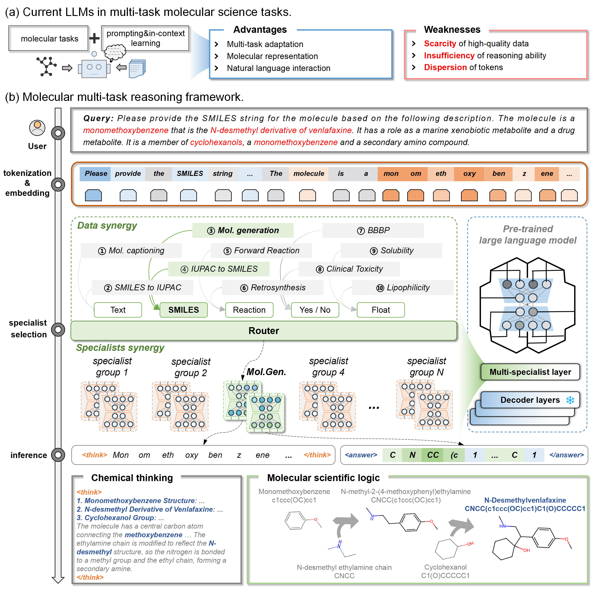

# A Synergistic Multi-Specialist Knowledge Reasoning Model for Molecular Science

The rapid evolution of artificial intelligence in molecular science necessitates a shift from data-driven predictions to knowledge-guided reasoning. Existing molecular models are predominantly proprietary, lacking general molecular intelligence and generalizability. To address this, we propose a task-adaptive large reasoning model that integrates molecular scientific logic to emulate the thinking of molecular scientists, with capabilities for reasoning and reflection. Our approach incorporates multi-specialist modules to provide versatile molecular expertise and a chain-of-thought (CoT) framework enhanced by reinforcement learning infused with molecular knowledge, enabling structured and reflective reasoning. The model outperforms over 20 state-of-the-art multi-task large language models (LLMs) across 10 molecular tasks on 47 metrics, including property prediction, molecule generation, and reaction prediction. It achieves a 50.3\% improvement over the base model while ensuring interpretability. It can bridge data-driven and knowledge-integrated approaches for intelligent molecular design.

## Overview Figure

**Figure 1: Overview of the reasoning framework.**
(a) Current LLMs in multi-task molecular science tasks, showcasing their core capabilities and inherent challenges.  
(b) Molecular multi-task reasoning framework, detailing the process from user query to inference, featuring tokenization and embedding, specialist selection via a router, and a multi-specialist layer within a pre-trained LLM. This framework unifies diverse molecular tasks through data synergy and embeds chemical logic into CoT reasoning for science-grounded outputs, with an example showcasing a text-based molecular generation task.
